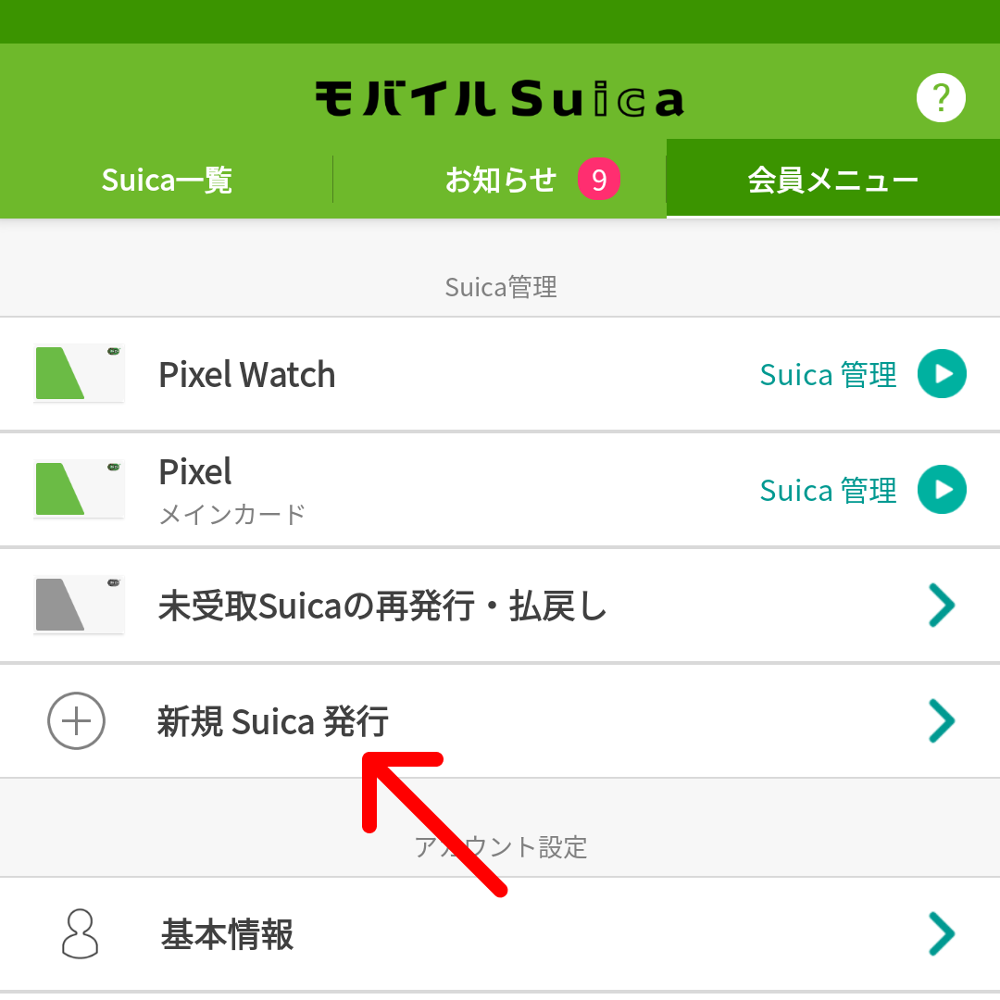
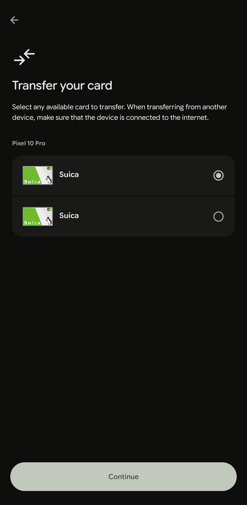
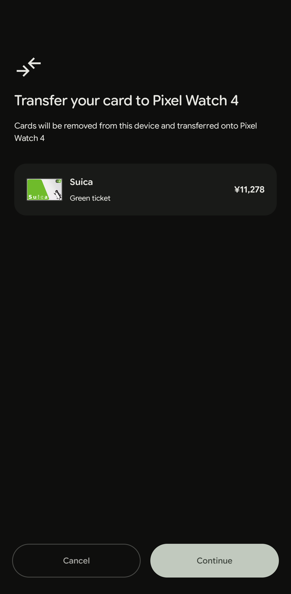
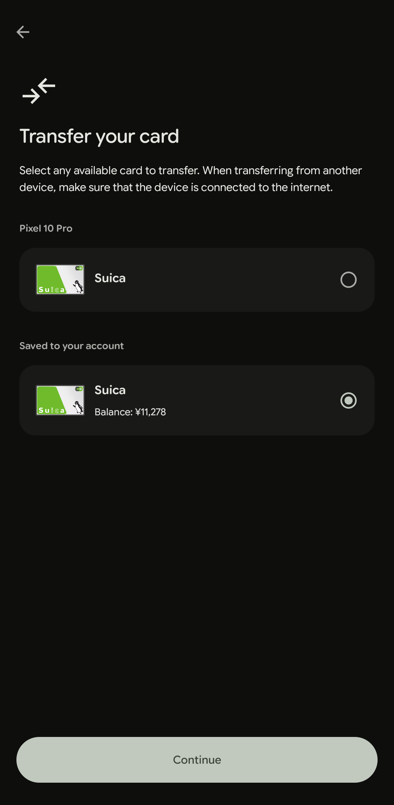
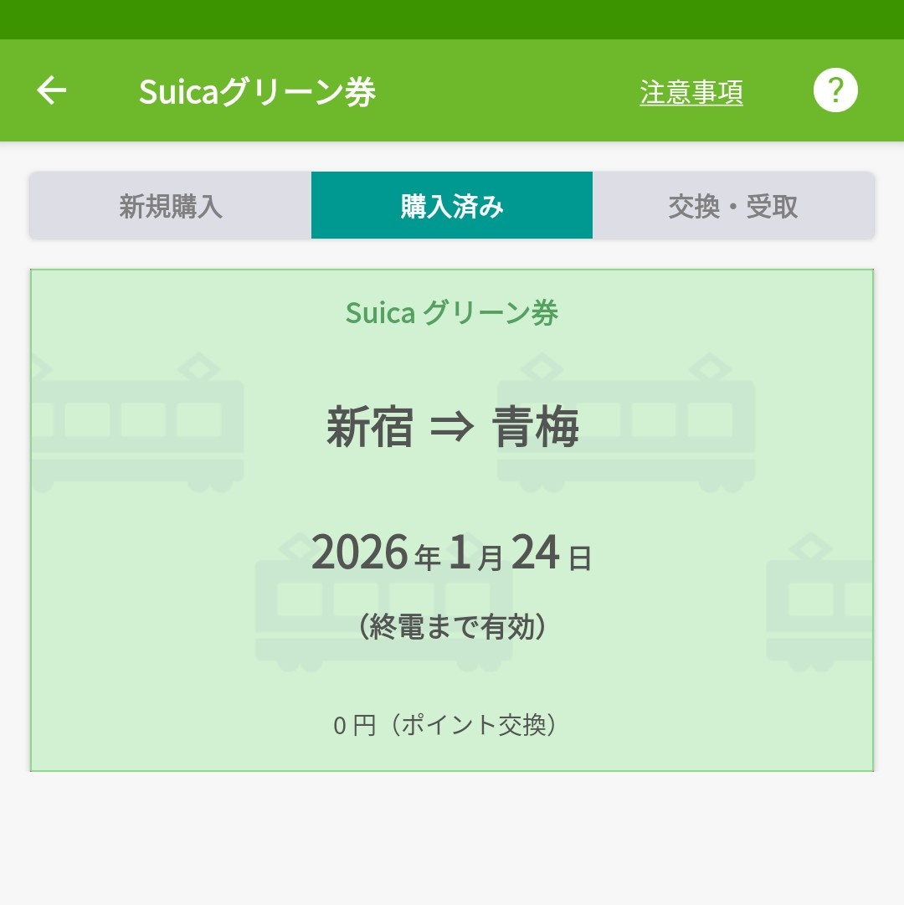
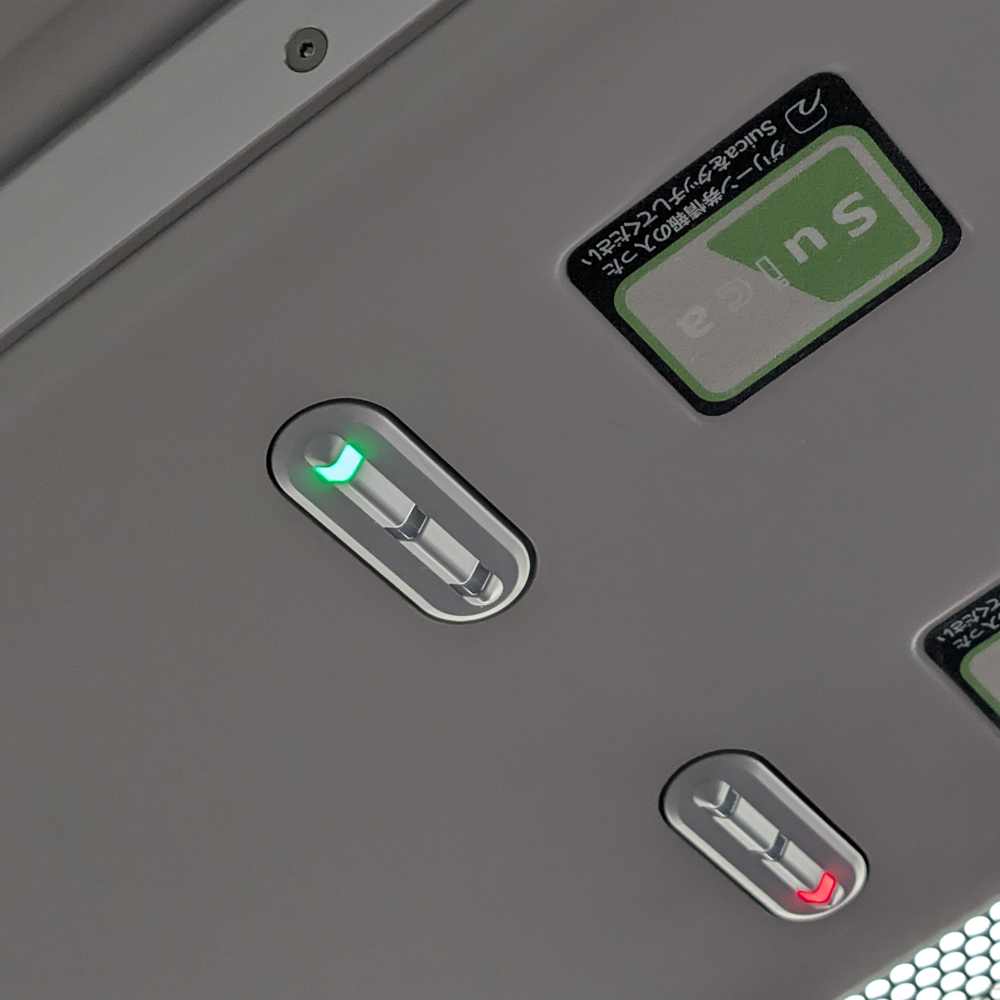

2026年7月23日、ウォッチでもグリーン券が利用できるようになるアナウンスがありました。
[Google Pixel Watch、Samsung Galaxy Watch にて 定期券や Suica グリーン券、おトクなきっぷが便利にご利用できるようになります！](https://www.jreast.co.jp/press/2026/20260723_ho01.pdf)
この記事の内容は全くの無価値になりますが、下書き書いちゃってたので公開しちゃいます。

Suica 発行時の初回チャージ1,000円は、池袋駅にて下記の通り消費しました。
ちょうど1,000円消費するための参考までに。(？)

- [めりけんや](https://merikenya.com/index.php/merikenyashop/ikebukuro): ぶっかけうどん並 540円、のり天 110円
- NewDays: [長崎カステラ](https://retail.jr-cross.co.jp/newdays/menu/detail/4121.html) 185円、[さっくりと焼き上げたエッグタルト](https://retail.jr-cross.co.jp/newdays/menu/detail/5181.html) 165円

---

スマートウォッチに Suica を入れておくと、改札でスマホを取り出すことなくスムーズに通り抜けることができ、人生を豊かにしてくれます。

しかしながら Suica のウォッチ対応はあまりよろしくなく、執筆現在[^1]グリーン券や定期券の購入・受け取りには対応してません。(Apple Watch はできるらしい。ずるい。)

[^1]: 執筆時点とは、2025年10月12日を指します。

私は定期券を利用してないのでその点は困っていないですが、グリーン券に関してはたまにゆったり長距離移動するために利用したいもの。

Suica はウォッチに入れておきたいが、たまにグリーン車は利用したい。
どうにかならんかと調べていると、どうもスマホとウォッチで Suica を二枚持ちして使い分けることができるようです。

これなら普段はウォッチを使いつつ、グリーン車を使いたい時だけスマホアプリでグリーン券を購入すれば良さそうです。

## 前提の整理

- Suica の二枚持ちはOK。
  - 参考: [モバイルSuicaアプリで複数のSuicaカードを使い分けて使用できますか？](https://msfaq.mobilesuica.com/faq/show/3341)
  - なお、二枚持ちできる機種は限られる様子なので要確認。
  - この記事では手持ちの Pixel 10 Pro、Pixel Watch 4 で試してます。
- 乗車に利用する Suica と、グリーン券を持つ Suica は別々でもOK。
  - 参考: [乗車に利用していないSuicaでグリーン券を購入しても使えますか？](https://msfaq.mobilesuica.com/faq/show/1835)

つまり Suica 二枚持ちして、ウォッチを乗車券、スマホをグリーン券代わりにすれば良いということです。

## 実際にやってみた

### 1. 一度ウォッチの Suica をスマホに移動する

はじめ、ウォッチに Suica が入っていてスマホに入っていない状況なら、単純に Google Wallet から新規発行手続きすれば良いかなと思っていたのですが、できない様子でした。
できそうな説明は出ていたのですが、ウォッチの Suica が邪魔している気がします。

なのでモバイル Suica アプリから新規発行することにしますが、スマホに Suica が入っていない状態だと会員登録から新規に行うことになるため、一度ウォッチからスマホに Suica を移動します。

本題じゃないので端折ります。ウォッチから Suica 削除しておサイフケータイアプリでダウンロードするだけです。

### 2. モバイル Suica アプリで二枚目の Suica を発行する
モバイル Suica アプリの「会員メニュー」タブにある「新規 Suica 発行」から二枚目の Suica を発行できます。

ボタンを押下し、あとは画面の指示に従って二枚目を発行します。

画像はすでに二枚目を発行している状態。ボタンが有効だが 3 枚目も作れるのか？

### 3. スマホに移した Suica をウォッチに戻す

モバイル Suica アプリでの操作のために一時的に移動した一枚目の Suica を、ウォッチに戻します。

こちらはスマホに移した時と違いやや厄介。
両方の Suica の名前が「Suica」としか表示されず、どっちがどっちかわからない...

たぶん作成した順になっており、上が元々ウォッチにあった方だと思います。
とりあえずどちらか選択して進めば残高が表示されたので、それで判別可能です。

面倒なのは、ここで間違えた方選択していてキャンセルした場合、すでに移行の処理が中途半端に進んでいるのか、再度操作しようとしてもしばらくの間エラーになりました。

おサイフケータイアプリ側なら最初から残高表示されていると思うので、運試しが面倒なら事前にそちらでアップロード操作しておくと楽かも。

おサイフケータイアプリでアップロードしておくと、今度はウォッチアプリ側でも最初から残高が表示された。なんなんだ。

ともかく、これでウォッチに一枚目、スマホに二枚目の Suica が入っている状態になりました。

## 実際にグリーン車に乗ってみる

Suica を二枚持ちできたので、ウォッチの Suica で改札を通り、グリーン車にはスマホをかざして乗車できるはずです。

まずはスマホの Suica にグリーン券を持たせます。
今回は新宿→青梅のグリーン券を JRE ポイントで交換。

乗車する新宿駅では、いつも通りウォッチの Suica で改札を通ります。

グリーン車に乗り込んだら、読み取り部分にはスマホをかざします。
これで、ライトが緑色に変わり、無事権利を示すことができました。

## まとめ

Suica の二枚持ちは公式に認められているクリーンな方法です。
クリーンでグリーンってことですね。(？)

グリーン車で快適な遠征を楽しみましょう。
