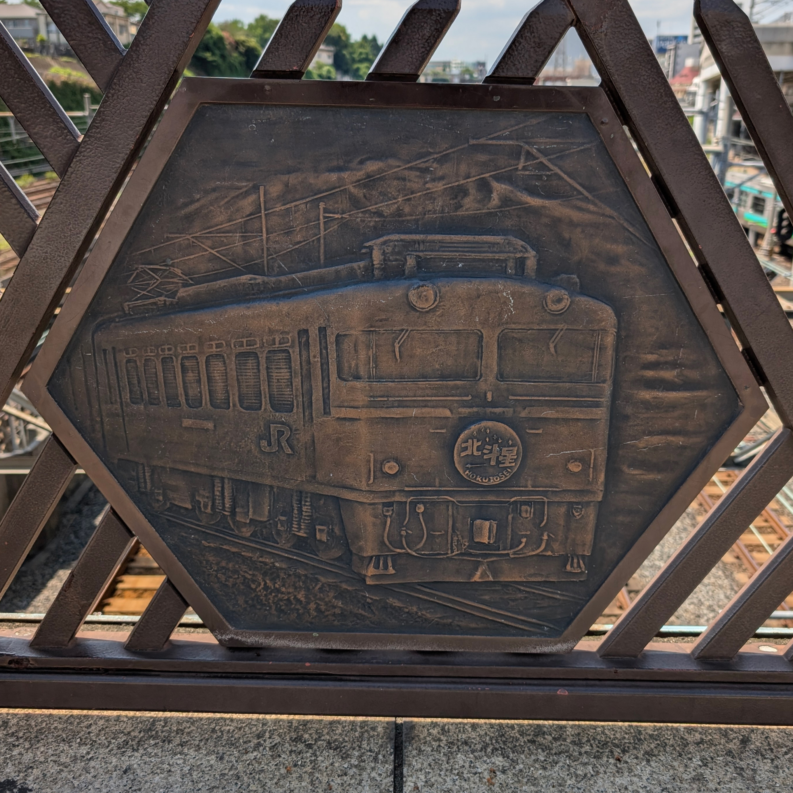

日暮里駅に行きました。
以前Twitterで「駅名標が猫になってる〜」と話題になっていたのを見て、おっしゃ行ったろという感じです。

ホームに降りると、掘り下げられた箇所があったので気になっていたら、新幹線が通ってました。
東北新幹線の上野駅は地下ホームらしいですが、ここから地上に出てくるんですね。

そして見づらいですが後ろにはスカイライナーが。初めて見た。

見上げると京成線のホーム。
この日は天気が良く、写真で見ると爽やかな雰囲気です。実際は猛暑でグタってました。

コンコースに向かう途中で、にゃっぽりに遭遇しました。

自分が見つけたのはこれだけですが、他にもあるみたいです。
事前情報なしで全部見つけるのはムズそう。

コンコースにはにゃっぽりとは別のイラスト展示もありました。

これは [Yamanote Line Museum](https://yamanotelinemuseum.com/) の展示みたいです。山手線でそんなのやってるんですね、全く知らんかった...

アートチックなベンチもありました。どれも人が座ってるので、実物はあまり見れず。

案内表示。スカイライナーにはここから乗るわけですね。
成田空港使ったことないので、そのうち乗ってみたい。

京成仕様の時計。

西口の方に「あらかわ俳句マップ」なるものがありました。

「松山市観光俳句ポスト」もあるみたいで、突然の地元成分を摂取しました。

そんなこんなで西口から出てきて、駅名標を見ることができました。
かわいい。建物もオシャレ。

駅前の橋の方に「日暮里を駆ける」って看板がありました。全体的に車両が一世代前感。そうでもないか。

橋の各所にいろんな車両が彫られたレリーフがありました。
トレインミュージアムなるバルコニーもあるらしく、列車を見るのに良い場所みたいです。

駅名標とにゃっぽりだけ見るつもりで来てましたが、鉄道系の要素もあったり、シンプルに初めて行ったので、いろいろ見て回れました。
