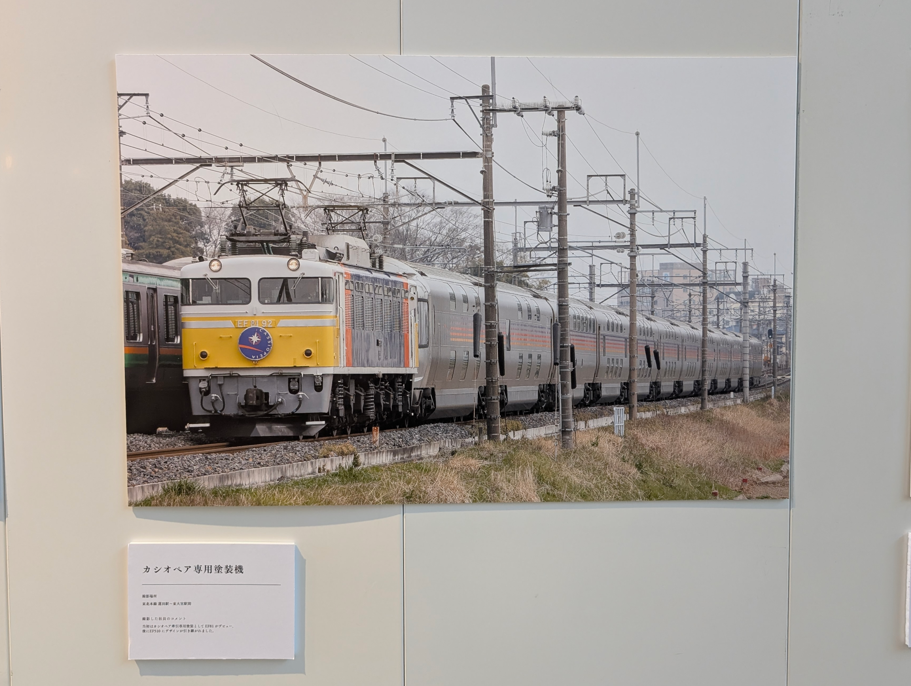
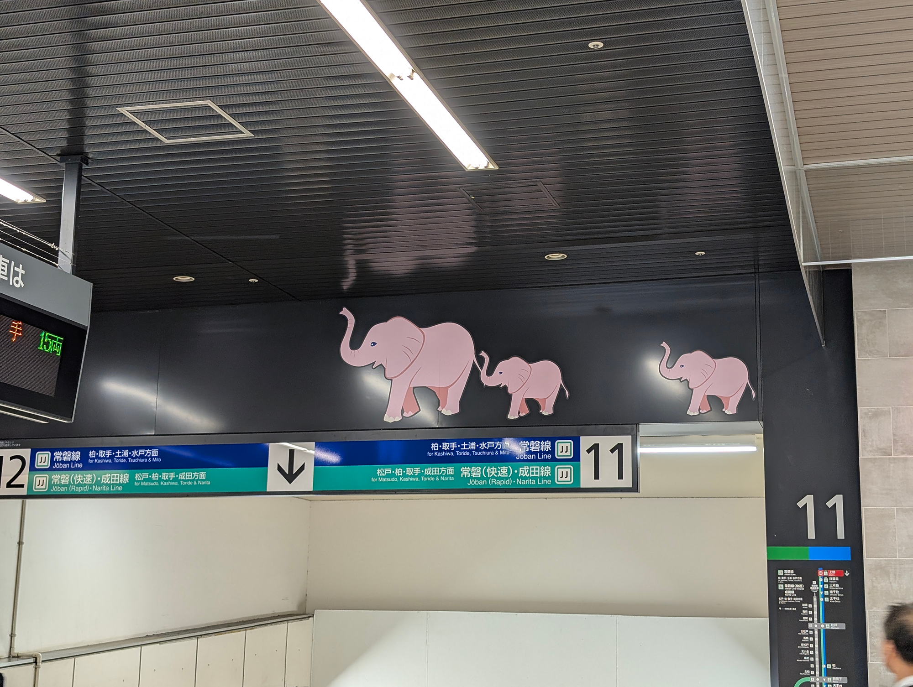

[日暮里駅散策](/posts/nippori-station-walk)の続きです。上野の方へ向かいます。

少し上野方面に歩いた場所から。京成線は日暮里駅から京成上野の方に出ると、すぐに90度近く曲がって、そのまま地下に入っていくんですねー。
日暮里駅では地上3階くらいにホームがあるのにすごくすごい。

そのまま歩いていると、珍しい気がする、縦書きの交差点名標識がありました。
調べてみると国際化の流れで横書き+ローマ字が推奨されてるらしいですけど、これは縦書き+横書きのローマ字を90度回転させたような表示。
たぶん珍しい。知らんけど。

上野公園まで来ました。だいぶ毛色が違う建物がありましたが、これが博物館動物公園駅跡らしい。
そう言われるとかなり博物館味がある。

そのまま歩いて京成上野駅に到着。なんとなくどこにあるのか気になってただけで、特に用事はないのでJRの上野駅へ。

上野駅では、この間引退したカシオペアの写真展が開かれてるみたいでした。

この写真で牽引に使用されている車両を、昔プラレールで持っていたような気がします。
写真を見た時、おお〜って感じでした。

13番ホームです、高級感があります。
TRAIN SUITE 四季島とか、カシオペアや北斗星なんかの特別な列車が発着するホームなんですね。
普段からなのか、期間限定の何かなのかはわかりませんが、画像左側の壁には寝台列車の紹介動画が投影されてるっぽかったです。

ゾウさんを増産。

上野とは関係ないのですが、この日はその後市ヶ谷駅の南北線ホームにあるフルスクリーンタイプのホームドアを見に行きました。

動く歩道もありました。
しかも傾斜が付いていて、空港とかにあるようなベルトのものではなく、普通のエスカレーターのようにブロックで構成されてる感じでした。
たぶん珍しい。知らんけど。

東京は歩いてるだけでも楽しいですね。
今回も予定にない発見がいろいろあって、見て回っていたら無事予定が全狂いしました。
