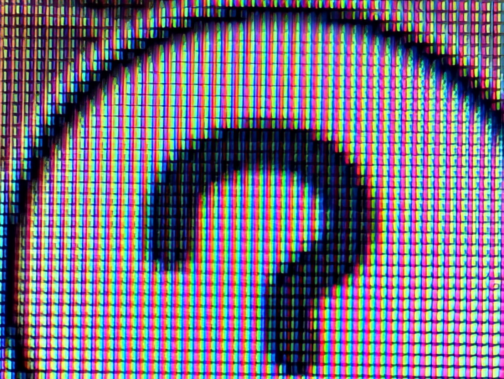

Pixel 9 Pro を購入しました。
以前は Pixel 6a を使っていて普段使いに全く支障はなかったのですが、カメラ目当てでの乗り換えです。

はたして 6a と比較して 9 Pro のカメラはどれほど優れた性能なのか...
日本の Pixel ユーザーがそれを確かめに行く場所はただ一つ、渋谷ストリームだけです。

というわけで、雑に 0.5x ~ 5x (30x) の写真で画質中心に比較してみます。
撮った時期が違うのと、写真は圧縮されちゃってるので、あんまり参考にはならないと思います。あしからず。

## 0.5x

まずは 0.5x です。
同じ場所から撮ってるはずなんですが、なんだか Pixel 9 Pro の方がより広角...？
そもそも写真のサイズも一回り大きくなってるみたいです。(3024x4032 → 3470x4609)

光の感じは結構な差がありますがこれは状況次第ですかね。9 Pro の方が好みではありますが、ちょっと激しすぎる印象。
しかし渋谷駅の方えっらい明るいですね。

|             Pixel 6a              |             Pixel 9 Pro             |
| :-------------------------------: | :---------------------------------: |
|  |  |

## 1x

1x はまあ差はないですかね。

|            Pixel 6a             |            Pixel 9 Pro            |
| :-----------------------------: | :-------------------------------: |
|  |  |

## 2x

こっから拡大に入ります。

レンズの種類は 1x と変わらないですが、画素数が 12.2 MP から 50 MP になっている分 9 Pro の方が拡大されても綺麗かも？

|            Pixel 6a             |            Pixel 9 Pro            |
| :-----------------------------: | :-------------------------------: |
|  |  |

## 5x

(6a の方 7x かも。)

6a は 2x の時と同じレンズなのに対して、9 Pro は望遠レンズになったので、流石に差が明らかになりました。
この拡大率でも十分見れるくらいの画質で撮れるのは嬉しいところ。

|            Pixel 6a             |            Pixel 9 Pro            |
| :-----------------------------: | :-------------------------------: |
|  |  |

## 30x

一応 9 Pro でだけ撮れる 30x も載せておきます。
もうちょっと綺麗に撮れた気もするけど、今回はボケボケ。

## マクロフォーカス

ここまで遠いものを撮ってましたが、逆に近いものを撮るためのマクロフォーカス機能もあるので、こちらも試してみます。
5x 拡大と合わせて、Macbook の RGB を捉えれるくらい。すごい。

